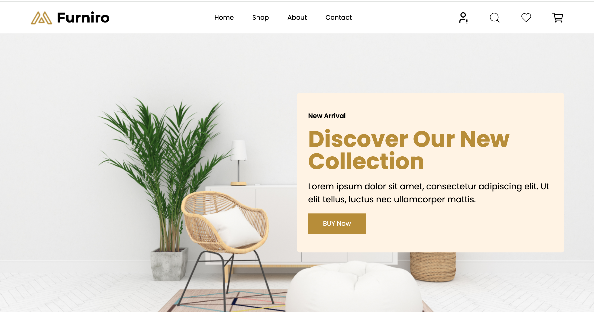
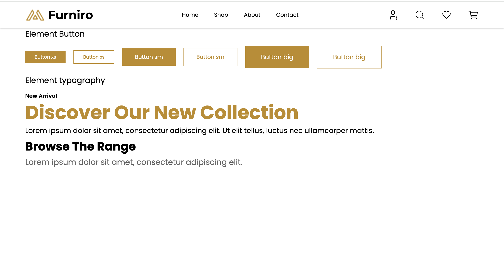

# E-Comm Template in React

Ce projet est une reproduction d'un template Figma en utilisant React et Tailwind CSS. Il s'agit d'une application de commerce électronique comprenant plusieurs pages et composants avec une interface moderne et conviviale.

## Aperçu du Projet

  
_Aperçu du composant Hero_

  
_Aperçu de l'interface utilisateur_

## Fonctionnalités

### Pages

- **Home** : Page d'accueil affichant les produits en vedette et les promotions.
- **Shop** : Page de boutique où les utilisateurs peuvent explorer tous les produits.
- **About** : Page "À propos" pour présenter l'entreprise.
- **Contact** : Formulaire pour que les clients puissent entrer en contact.
- **Single Product** : Page dédiée pour les détails d'un produit.
- **Cart** : Page pour afficher et gérer les produits dans le panier.
- **Checkout** : Page de validation des commandes.
- **Produit Comparaison** : Comparaison des caractéristiques des produits.
- **Blog** : Section blog avec des articles pertinents.

### Composants Importants

- **Sidebar** : Menu latéral pour faciliter la navigation.
- **Cart Sidebar** : Composant pour un aperçu rapide du panier.

## Lien du Site Déployé

[Visitez le site ici](https://e-comm-44af6.web.app)

## Lien Figma

[Voir le design Figma ici](<https://www.figma.com/design/6CLCdq0v1bVbdfoFKSY8cQ/eCommerce-Website-%7C-Web-Page-Design-%7C-UI-KIT-%7C-Interior-Landing-Page-(Community)?node-id=117-336&node-type=frame&t=25bgKDwB6pDdH2Bv-0>)

## Technologies Utilisées

- **React.js** : Bibliothèque pour créer des interfaces utilisateur.
- **Tailwind CSS** : Framework CSS pour un style rapide et flexible.
- **React Router** : Pour la navigation entre les pages.
- **Firebase Hosting** : Plateforme utilisée pour déployer l'application.

## Installation

1. **Clonez le projet :**
   ```bash
   git clone <URL-du-repository>
   cd e-comm-template
   ```
